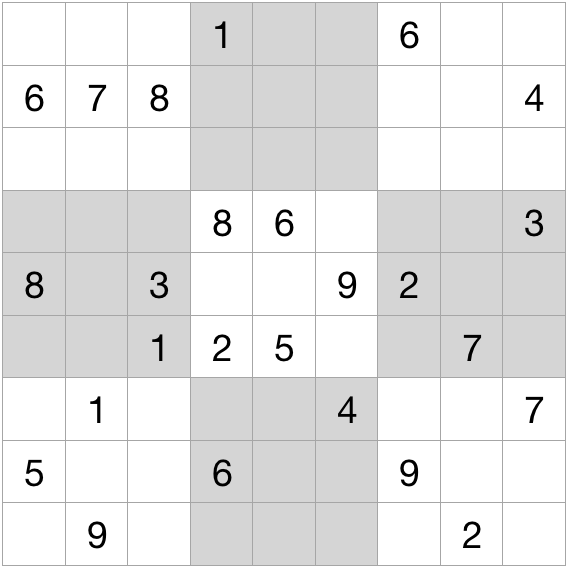
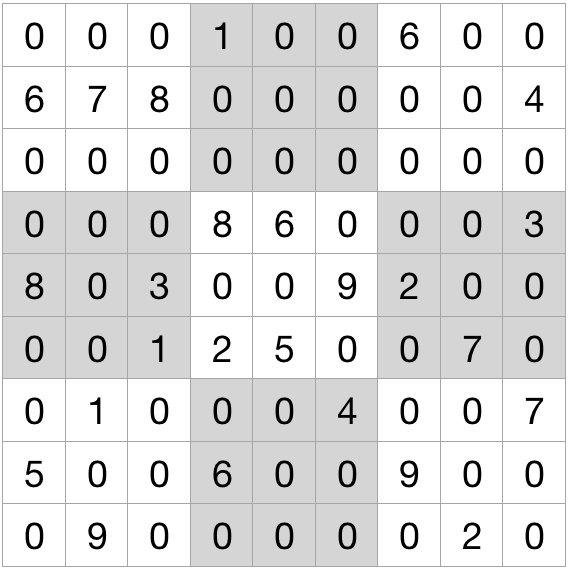

# sudoku
A python model to solve sudoku

## Usage

Here is a question like this:



1. Fill each blank with 0



2. Treat 81 numbers as string like this:
'000100600678000004000000000000860003803009200001250070010004007500600900090000020'

And the string is all you need to create the object.

The object will solve the question when it is created.


```
>>> from sudoku.models import Sudoku

>>> s = Sudoku('000100600678000004000000000000860003803009200001250070010004007500600900090000020')

>>> s.question
[0, 0, 0, 1, 0, 0, 6, 0, 0, 6, 7, 8, 0, 0, 0, 0, 0, 4, 0, 0, 0, 0, 0, 0, 0, 0, 0, 0, 0, 0, 8, 6, 0, 0, 
0, 3, 8, 0, 3, 0, 0, 9, 2, 0, 0, 0, 0, 1, 2, 5, 0, 0, 7, 0, 0, 1, 0, 0, 0, 4, 0, 0, 7, 5, 0, 0, 6, 0, 
0, 9, 0, 0, 0, 9, 0, 0, 0, 0, 0, 2, 0]

>>> s.answer
[2, 3, 5, 1, 4, 7, 6, 8, 9, 6, 7, 8, 9, 2, 5, 1, 3, 4, 1, 4, 9, 3, 8, 6, 7, 5, 2, 7, 2, 4, 8, 6, 1, 5, 
9, 3, 8, 5, 3, 4, 7, 9, 2, 1, 6, 9, 6, 1, 2, 5, 3, 4, 7, 8, 3, 1, 2, 5, 9, 4, 8, 6, 7, 5, 8, 7, 6, 3, 
2, 9, 4, 1, 4, 9, 6, 7, 1, 8, 3, 2, 5]

>>> s.print()
 0 0 0  1 0 0  6 0 0 
 6 7 8  0 0 0  0 0 4 
 0 0 0  0 0 0  0 0 0 

 0 0 0  8 6 0  0 0 3 
 8 0 3  0 0 9  2 0 0 
 0 0 1  2 5 0  0 7 0 

 0 1 0  0 0 4  0 0 7 
 5 0 0  6 0 0  9 0 0 
 0 9 0  0 0 0  0 2 0 

>>> s.print_answer()
 2 3 5  1 4 7  6 8 9 
 6 7 8  9 2 5  1 3 4 
 1 4 9  3 8 6  7 5 2 

 7 2 4  8 6 1  5 9 3 
 8 5 3  4 7 9  2 1 6 
 9 6 1  2 5 3  4 7 8 

 3 1 2  5 9 4  8 6 7 
 5 8 7  6 3 2  9 4 1 
 4 9 6  7 1 8  3 2 5 
```
